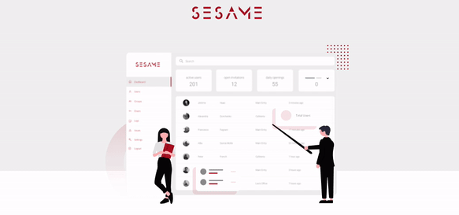

## Sesame Website

Sesame is a non-profit open source access management system for organisations. The main goal of sesame is to provide an easier way to give the users of your organisationsto different rooms and areas of your organisation. By using our mobile application, users can just scan their face to authorize and to open doors.

- See the entries of all time in the protocol
- Adjust the permissions with a few clicks
- Have complete control over who can access which facilities
- Get an overview of the access management of your organisation